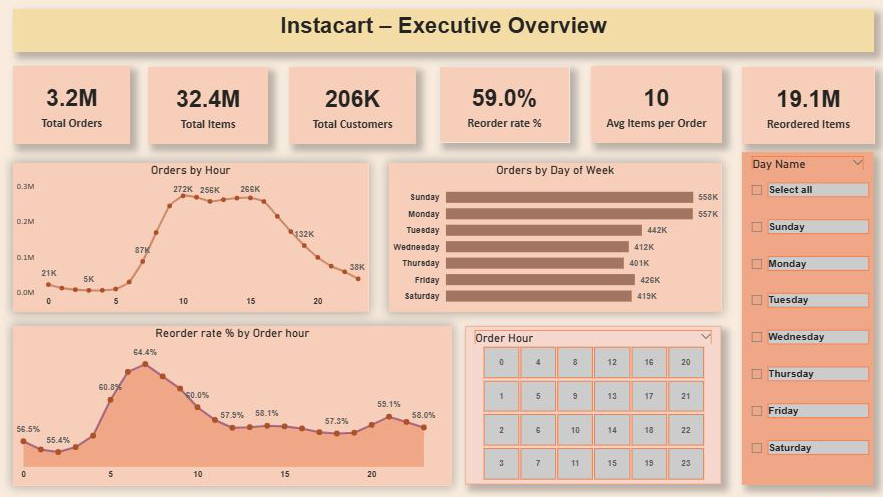
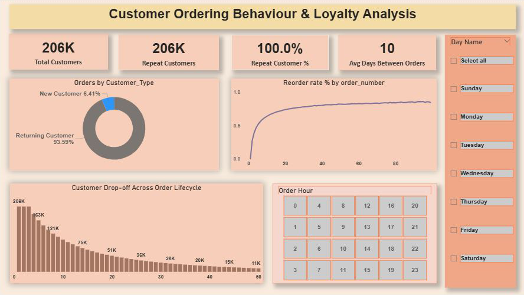
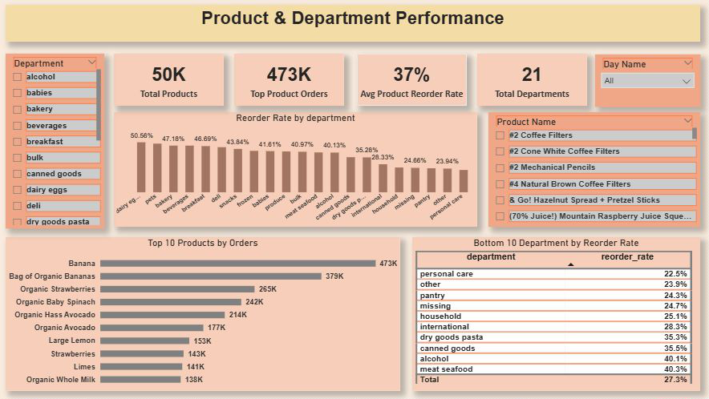
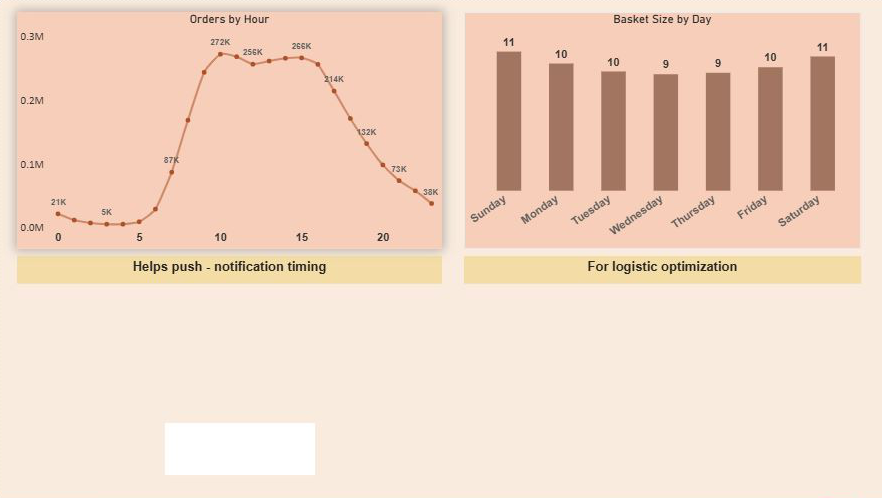

# 🛒 Instacart Data Analysis Project
End-to-end data analytics project using SQL, Python, and Power BI. Includes business insights, KPIs, and recommendations.

## 📌 Project Overview
This project analyzes customer purchasing behavior, reorder patterns, and product performance using Instacart grocery order data.

The goal is to provide **business insights** that help improve:
- Customer retention
- Product reordering strategy
- Demand planning
- Marketing & notification timing

---

## 🧰 Tools & Technologies
- **Python**: Data Cleaning & Preprocessing (Pandas)
- **SQL (PostgreSQL)**: Data Analysis & KPI creation
- **Power BI**: Interactive Dashboards & DAX Measures

---

## 📊 Key Analysis Performed
### 1. Executive Overview
- Total Orders, Customers, Items
- Reorder Rate
- Order trends by day & hour

### 2. Customer Ordering Behaviour
- New vs Returning Customers
- Repeat customer analysis
- Customer drop-off across order lifecycle

### 3. Product & Department Performance
- Top & Bottom products by orders
- Reorder rate by department
- High-performing categories

### 4. Time & Basket Analysis
- Best order hours
- Basket size by day
- Logistics & notification timing insights

---

## 📈 Business Insights
- Peak ordering hours are between **10 AM – 4 PM**
- Reorder rate increases significantly after the 2nd order
- Certain departments show low reorder potential and need optimization
- Sundays & Mondays show highest demand

---

## 💡 Business Recommendations
- Optimize push notifications during peak hours
- Focus retention campaigns after 1st order
- Improve assortment in low reorder departments
- Plan logistics capacity for weekends

---

## 📎 Dashboard Preview

## Power BI Dashboard
Due to GitHub file size limits, the PBIX file is shared via Google Drive.

🔗 Download PBIX file: [Click here](https://drive.google.com/file/d/1c9rZsuGrrBjjHY--tzwLyi-lw7EcxClb/view?usp=sharing)

---

## 🔗 Author
**Deepali (Lucky)**  
Aspiring Data Analyst  

Thank you for visiting my project! I am constantly looking to improve my data analysis skills, so your feedback is incredibly valuable to me.
 You can also reach out to me via [LinkedIn](https://www.linkedin.com/in/deepali-maity-0382701ba).

**I would love to hear your thoughts on:**
* **Technical Implementation:** Are there more efficient ways I could have handled the data cleaning or used specific libraries (e.g., Pandas, Seaborn)?
* **Insights & Accuracy:** Do the conclusions drawn from the visualizations align with the data provided?
* **Future Scope:** What other variables or external datasets could I incorporate to make this analysis more robust?

